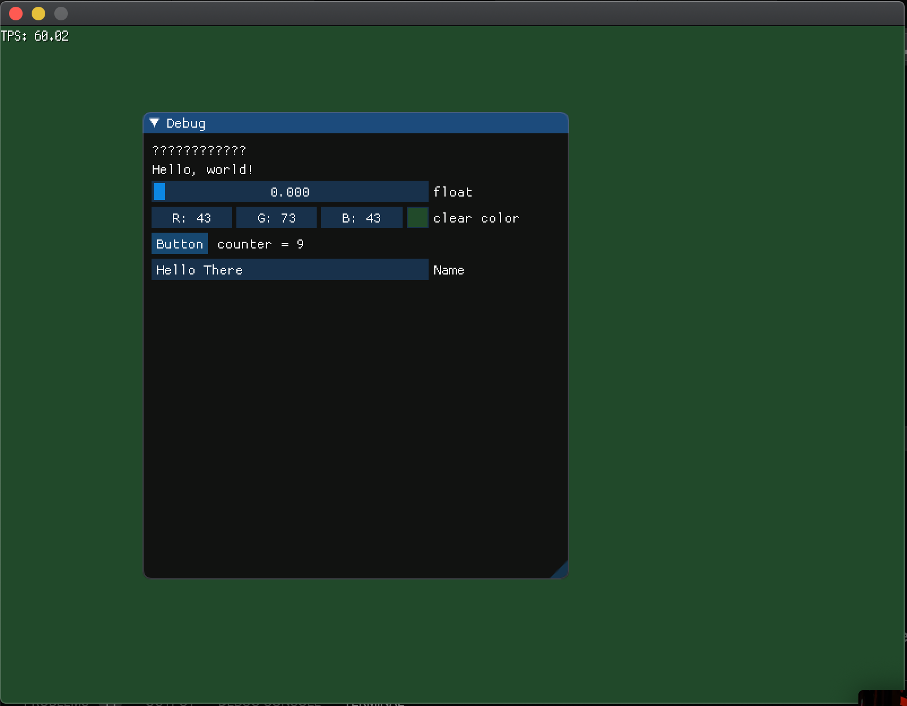

Dear ImGui for Ebiten
=====================

A renderer of [imgui-go](https://github.com/inkyblackness/imgui-go) for [Ebiten](https://github.com/hajimehoshi/ebiten/v2)!

This project is in a pre-alpha stage. The API might change in future versions.



Usage:

```go
package main

import (
	"fmt"
	"image/color"

	"github.com/gabstv/ebiten-imgui/renderer"
	"github.com/hajimehoshi/ebiten/v2"
	"github.com/hajimehoshi/ebiten/v2/ebitenutil"
	"github.com/inkyblackness/imgui-go/v2"
)

func main() {
	mgr := renderer.New(nil)

	ebiten.SetWindowSize(800, 600)

	gg := &G{
		mgr: mgr,
	}

	ebiten.RunGame(gg)
}

type G struct {
	mgr *renderer.Manager
	// demo members:
	clearColor [3]float32
	floatVal   float32
	counter    int
	name       string
}

func (g *G) Draw(screen *ebiten.Image) {
	screen.Fill(color.RGBA{uint8(g.clearColor[0] * 255), uint8(g.clearColor[1] * 255), uint8(g.clearColor[2] * 255), 255})
	g.mgr.BeginFrame()

	{
		imgui.Text("ภาษาไทย测试조선말")                        // To display these, you'll need to register a compatible font
		imgui.Text("Hello, world!")                       // Display some text
		imgui.SliderFloat("float", &g.floatVal, 0.0, 1.0) // Edit 1 float using a slider from 0.0f to 1.0f
		imgui.ColorEdit3("clear color", &g.clearColor)    // Edit 3 floats representing a color

		//imgui.Checkbox("Demo Window", &showDemoWindow) // Edit bools storing our window open/close state
		//imgui.Checkbox("Go Demo Window", &showGoDemoWindow)
		//imgui.Checkbox("Another Window", &showAnotherWindow)

		if imgui.Button("Button") { // Buttons return true when clicked (most widgets return true when edited/activated)
			g.counter++
		}
		imgui.SameLine()
		imgui.Text(fmt.Sprintf("counter = %d", g.counter))

		imgui.InputText("Name", &g.name)
	}

	g.mgr.EndFrame(screen)
	ebitenutil.DebugPrint(screen, fmt.Sprintf("TPS: %.2f", ebiten.CurrentTPS()))
}

func (g *G) Update(screen *ebiten.Image) error {
	g.mgr.Update(1.0/60.0, 800, 600)
	return nil
}

func (g *G) Layout(outsideWidth, outsideHeight int) (int, int) {
	return 800, 600
}
```
